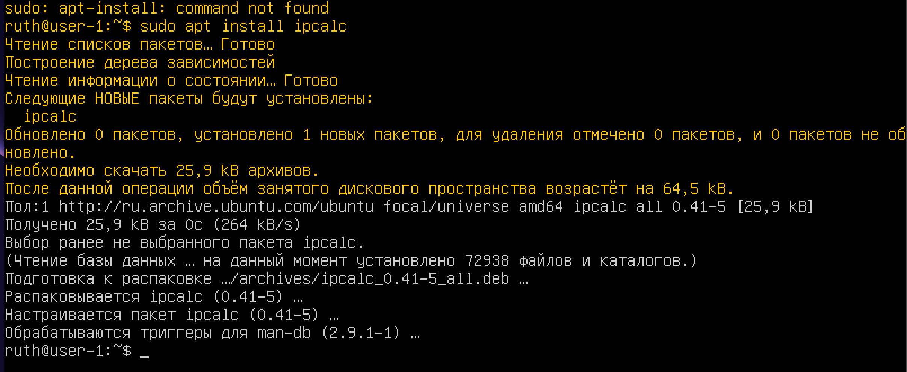
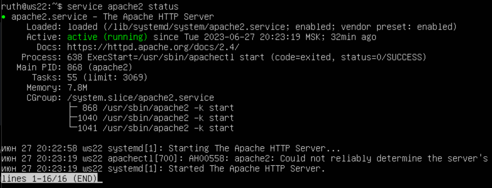

# Linux Network
## Содержание

1. [Инструмент ipcalc](#part-1-инструмент-ipcalc)
2. [Статическая маршрутизация между двумя машинами](#part-2-статическая-маршрутизация-между-двумя-машинами)
3. [Утилита iperf3](#part-3-утилита-iperf3)
4. [Сетевой экран](#part-4-сетевой-экран)
5. [Статическая маршрутизация сети](#part-5-статическая-маршрутизация-сети)
6. [Динамическая настройка IP с помощью DHCP](#part-6-динамическая-настройка-ip-с-помощью-dhcp)
7. [NAT](#part-7-nat)
8. [Допополнительно. Знакомство с SSH Tunnels](#part-8-дополнительно-знакомство-с-ssh-tunnels)

## Part 1. Инструмент **ipcalc**
- ``Устанавливаем ipcalc командой  - sudo apt install ipcalc`` 
 

---
### 1.1. Сети и маски
- ``Определил адрес сети 192.160.38.54/13 - 192.160.0.0``
 
- ``Перевёл маску 255.255.255.0 в префиксную и двоичную запись``
- ``255.255.255.0 - в префиксной записи 24``
- ``255.255.255.0 - в двоичной записи 11111111.11111111/11111111.00000000``
 

---
- ``Перевёл маску /15 в обычную и двоичную запись``
- ``Получаем перевод маски /15 в обычную запись - 255.254.0.0``
- ``Перевод маски /15 в бинарную запись - 11111111.11111110.00000000. 000000000``
 

- ``Получаем перевод маски 11111111.11111111.11111111.11110000 в обычную запись - 255.255.255.240``
- ``Перевод маски 11111111.11111111.11111111.11110000 в префиксную запись - /28``
 
---
- ``Определил минимальный и максимальный хост в сети 12.167.38.4``
- ``минимальный хост при маске /8 - 12.0.0.1``
- ``максимальный хост при маске /8 - 12.255.255.254``
 
- ``минимальный хост при маске 11111111.11111111.00000000.00000000 - 12.167.0.1``
- ``максимальный хост при маске 11111111.11111111.00000000.00000000 - 12.167.255.254``
 
- ``минимальный хост при маске 255.255.254.0 - 12.167.38.1``
- ``максимальный хост при маске 255.255.254.0 - 12.167.39.254``
 
- ``минимальный хост при маске /4 - 0.0.0.1``
- ``максимальный хост при маске /4 - 15.255.255.254``
 
---
### 1.2. localhost
- ``194.34.23.100: Не удалось пинговать localhost через этот IP-адрес.``
- ``127.0.0.2: Удалось пинговать localhost через этот IP-адрес.``
- ``127.1.0.1: Удалось пинговать localhost через этот IP-адрес.``
- ``128.0.0.1: Не удалось пинговать localhost через этот IP-адрес.``

- ``IP-адреса 127.0.0.2 и 127.1.0.1 являются допустимыми IP-адресами для обращения к localhost. Оба этих адреса являются частью петли обратной связи (loopback) и предназначены для локальных коммуникаций в пределах вашей машины.``

- ``Обычно в сетях IPv4 установлено правило, согласно которому весь диапазон 127.0.0.0/8 зарезервирован для петли обратной связи, и 127.0.0.1 является стандартным адресом петли обратной связи.``

- ``Однако IP-адрес 127.0.0.2 также является допустимым адресом петли обратной связи в некоторых конфигурациях. Поэтому, если вы успешно пингуете 127.0.0.2, это означает, что ваша система настроена для принятия пакетов, адресованных этому IP-адресу как к localhost.``

- ``IP-адрес 194.34.23.100 и 128.0.0.1 не являются частью петли обратной связи и не должны использоваться для доступа к приложению, работающему на localhost.``
 
---
### Диапазоны и сегменты сетей
- ``Диапазоны частных IP-адресов:``
- ``Класс A: 10.0.0.0 - 10.255.255.255``
- ``Класс B: 172.16.0.0 - 172.31.255.255``
- ``Класс C: 192.168.0.0 - 192.168.255.255``

- ``Публичные: 134.43.0.2, 172.0.2.1, 192.172.0.1, 192.169.168.1``

- ``Частные: 10.0.0.45, 10.10.10.10, 192.168.4.2, 172.20.250.4, 172.68.0.2, 172.16.255.255``

- ``Можно проверить с помощью утилиты ipcalc, проверяя каждый адрес.``
- ``Данные сети 10.0.0.45``
 
- ``Данные сети 134.43.0.2``
 

- ``У сети 10.10.0.0/18 возможны следующие IP адреса шлюза: 10.10.0.2, 10.10.1.255, 10.10.10.10.``
- ``У сети 10.10.0.0/18 не возможны следующие IP адреса шлюза: 10.0.0.1, 10.10.100.1.``
 
---
## Part 2. Статическая маршрутизация между двумя машинами

### Cетевые интерфейсы
- ``Поднять две виртуальные машины (далее -- ws1 и ws2)``
- ``С помощью команды ip a смотрим существующие сетевые интерфейсы``
 
- ``lo — это (внутренний) петлевой адрес, используемый для подключения по сети к этому же компьютеру, не требует дополнительной настройки.``
- ``lo: Имя сетевого интерфейса в виде строки.``
- ``<LOOPBACK,UP,LOWER_UP>: LOOPBACK - петлевой интерфейс. UP - означает, что интерфейс работает. LOWER_UP - физический сетевой уровень (первый уровень) также работает.``
- ``mtu 65536: максимальная единица передачи. Это размер наибольшего фрагмента данных, который может передавать этот интерфейс.``
- ``qdisc noqueue: qdisc — это механизм организации очередей. Планирует передачу пакетов. Существуют различные методы очередей, называемые дисциплинами. Дисциплина noqueue означает «отправляй мгновенно, не ставь в очередь». Это стандартная дисциплина qdisc для виртуальных устройств, например адресов LOOPBACK.``
- ``state UNKNOWN: могут быть такие состояния как DOWN (сетевой интерфейс не работает), UNKNOWN (сетевой интерфейс работает, но ничего не подключено) или UP (сеть работает и соединение установлено).``
- ``group default: интерфейсы могут быть сгруппированы логически. По умолчанию они помещаются в группу под названием «default».``
- ``qlen 1000: максимальная длина очереди передачи.``
- ``link/loopback: адрес управления доступом к среде (MAC) интерфейса.``
- ``inet 127.0.0.1/8: IP-адрес версии 4. Часть адреса после косой черты (/) представляет собой нотацию бесклассовой междоменной маршрутизации (CIDR), представляющую маску подсети. Она указывает, сколько ведущих непрерывных битов имеют значение единица в маске подсети. Значение восемь означает восемь битов. Восемь битов, равных единице, представляют 255 в двоичном виде, поэтому маска подсети равна 255.0.0.0.``
- ``scope host: область IP-адреса. Этот IP-адрес действителен только внутри компьютера («хост»).``
- ``lo: интерфейс, с которым связан этот IP-адрес.``
- ``valid_lft: допустимое время жизни. Для IP-адреса версии 4 IP, назначенного протоколом динамической конфигурации хоста (DHCP), это период времени, в течение которого IP-адрес считается действительным и может создавать и принимать запросы на подключение.``
- ``preferred_lft: предпочтительное время жизни. Для IP-адреса версии 4, выделенного протоколом DHCP, это количество времени, в течение которого IP-адрес может использоваться без ограничений. Оно никогда не должно быть больше значения valid_lft.``
- ``inet6: IP-адрес версии 6, оvalid_lft и preferred_lft смотри выше.``
- ``enp0s3 — конфигурируемый офизический интерфейс проводного сетевого подключения «en» обозначает Ethernet, «p0» - номер шины карты Ethernet, а «s3» - номер слота;``

- ``В редакторе nano изменил файлы etc/netplan/00-installer-config.yaml для виртуальных машин ws1, ws2.``
 
- ``Выполняем команду sudo netplan apply для перезапуска сервиса сети``
- ``Проверяем сохранились ли изменения командой ip a``
 
---
### 2.1. Добавление статического маршрута вручную
- ``Tool -> preferences -> network -> создаем новую сеть ShamanNet``
- ``Settings -> network -> включаем адаптер, выбираем NAT network ShamanNet у каждой виртуальной машины``
 
 
 

- ``Добавляем статический маршрут от (ws1 до ws2) и от (ws2 до ws1) при помощи команды вида ip r add``
 
- ``Пропинговываем соединение между машинами``
 
 
---
### 2.2. Добавление статического маршрута с сохранением
- ``После перезапуска машин маршруты не сохранились. При попытке пропинговать одну ту или иную машину, выдается, что сеть не найдена.``
 
- ``Добавил статический маршрут от одной машины до другой изменив в редакторе vim файлы двух виртуальных машин ws1, ws2 sudo vim /etc/netplan/00-installer-config.yaml``
 
- ``Для применения настроек запустил команду sudo netplan apply.``
 
- ``Пропинговал соединение между машинами ws1 и ws2 отправкой 5 пакетов.``
 
- ``Для повторной проверки перезапустил виртуальные машины и пропинговал их ещё раз отправкой 5 пакетов.``
 
---
## Part 3. Утилита iperf3

### 3.1. Скорость соединения
- ``8 Mbps в MB/s, 1 Mbps = 0.125 MB/s. Поэтому 8 Mbps = 8 * 0.125 = 1 MB/s. 100 MB/s в Kbps: 1 MB/s = 8 Mbps``
- ``Поэтому 100 MB/s = 100 * 8 = 800 Mbps = 800000 Kbps, 1 Gbps в Mbps: 1 Gbps = 1000 Mbps``
- ``Таким образом:``
- ``8 Mbps = 1 MB/s``
- ``100 MB/s = 800000 Kbps``
- ``1 Gbps = 1000 Mbps``
---
### 3.2. Утилита iperf3
- ``iperf3 — кроссплатформенная консольная клиент-серверная программа — генератор TCP и UDP трафика для тестирования пропускной способности сети, проведения нагрузочного тестирования канала связи.``
- ``Устанавливаем утилиту iperf3 командой sudo apt install iperf3 на обе машины.``
- ``На ws1 запускаем iperf3 в режиме сервера: iperf3 -s``
 
- ``Теперь к ws1 можно подключаться по порту 5201 клиентам iperf3:``
- ``На клиенте (ws2) запускаем iperf3 с указанием IP сервера к которому подключаемся iperf3 -c 192.168.120.100 -R``
- ``-с — адрес сервера с запущенным iperf3 на 5201 порту``
- ``-R — режим Reverse Mode для тестирования входящей скорости``
 
 
- ``Максимальное среднее значение пропускной способности между двумя виртуальными машинами ws1 и ws2 при передачи 1.77 GBytes (Гбайт) составила 1.52 GBits/sec (Гбит/сек).``

---
## Part 4. Сетевой экран

### 4.1. Утилита iptables

- ``Утилита iptables представляет собой инструмент командной строки в операционных системах Linux, который используется для настройки и управления файрволом (firewall) и системой пакетной фильтрации в ядре Linux. Она позволяет контролировать поток сетевых пакетов в системе, определять правила фильтрации и маршрутизации для обеспечения безопасности и контроля доступа к сетевым ресурсам.``

- ``Некоторые основные возможности и концепции, связанные с утилитой iptables, включают:``

- ``Правила фильтрации: iptables позволяет определять правила, которые указывают, какие сетевые пакеты должны быть разрешены или запрещены на основе различных атрибутов пакета, таких как исходный и целевой IP-адрес, порты и протоколы.``

- ``Цепочки: iptables использует концепцию цепочек для организации правил фильтрации. Встроенные цепочки, такие как INPUT, OUTPUT и FORWARD, определяют, как обрабатываются пакеты на разных этапах прохождения через систему.``

- ``Таблицы: iptables имеет несколько таблиц, таких как filter, nat и mangle, которые определяют контексты для применения правил фильтрации и маршрутизации.``

- ``Состояния подключения: iptables может учитывать состояние подключения пакетов, что позволяет контролировать только определенные этапы обмена данными, такие как установление нового соединения или уже установленные соединения.``

- ``Сетевое перенаправление: iptables позволяет настраивать перенаправление пакетов, что полезно для реализации NAT (Network Address Translation), маскарадинга и других методов маршрутизации сетевых пакетов.``
 
- ``Нужно добавить в файл подряд следующие правила:``

- ``1) на ws1 применить стратегию когда в начале пишется запрещающее правило, а в конце пишется разрешающее правило (это касается пунктов 4 и 5)``

- ``2) на ws2 применить стратегию когда в начале пишется разрешающее правило, а в конце пишется запрещающее правило (это касается пунктов 4 и 5)``

- ``3) открыть на машинах доступ для порта 22 (ssh) и порта 80 (http)``

- ``4) запретить echo reply (машина не должна "пинговаться”, т.е. должна быть блокировка на OUTPUT)``

- ``5) разрешить echo reply (машина должна "пинговаться")``
 
- ``Сохраняем с провами и запускаем скрипт``
 
- ``Пингуем``
 
- ``Скрипт для ws1 применяет стратегию, когда в начале файла указано запрещающее правило (iptables -P OUTPUT DROP), а в конце файла разрешающее правило (iptables -P INPUT ACCEPT). Таким образом, все исходящие соединения будут запрещены, но все входящие соединения разрешены.``

- ``Скрипт для ws2 применяет стратегию, когда в начале файла указано разрешающее правило (iptables -P OUTPUT ACCEPT), а в конце файла запрещающее правило (iptables -P INPUT DROP). Это означает, что все исходящие соединения разрешены, но все входящие соединения будут запрещены.``
---
### 4.2. Утилита nmap
- ``Командой ping найти машину, которая не "пингуется", после чего утилитой nmap показать, что хост машины запущен. Проверка: в выводе nmap должно быть сказано: Host is up``
 
- ``Дамбаем ws1 и ws2``
 
---
## Part 5. Статическая маршрутизация сети
- ``Поднять пять виртуальных машин (3 рабочие станции (ws11, ws21, ws22) и 2 роутера (r1, r2))``
 
 
---
### 5.1. Настройка адресов машин
- ``Настроить конфигурации машин в etc/netplan/00-installer-config.yaml согласно сети на рисунке.``
 
 
- ``Перезапустить сервис сети. Если ошибок нет, то командой ip -4 a проверить, что адрес машины задан верно. Также пропинговать ws22 с ws21. Аналогично пропинговать r1 с ws11.``
- ``ws11``
 
- ``ws21``
 
- ``ws22``
 
- ``r1``
 
- ``r2``
 
- ``Пингуем ws22 с ws21``
 
- ``Пингуем r1 с ws11``
 
---
### 5.2. Включение переадресации IP-адресов.
- ``Для включения временной переадресации IP выполняем команду на роутерах: sudo sysctl -w net.ipv4.ip_forward=1``
 
- ``Для включения IP-переадресации на постоянной основе добавляем в файл /etc/sysctl.conf следующую строку: net.ipv4.ip_forward = 1``
 
 
- ``Перезагружаем и выполняем команду sysctl net.ipv4.ip_forward для проверки:``
 
- ``Параметр ядра net.ipv4.ip_forward равен 1. Это означает, что переадресация включена.``
---
### 5.3. Установка маршрута по-умолчанию
- ``Добавляем маршрут по-умолчанию в файле конфигураций etc/netplan/00-installer-config.yaml.``
- ``Добавил строку gateway4: <IP-адрес роутера>.``
- ``Вызываем ip r и показать, что добавился маршрут в таблицу маршрутизации``
 

- ``Пингуем с ws11 роутер r2:``
- ``Пинг не пройдёт, т.к. роутер "не знает" куда вернуть ответ, при этом передача пакетов с машины осуществляется.
Чтобы посмотреть какие девайсы можно прослушать используем команду *tcpdump -D*.``
- ``Показываем на r2, что пинг доходит с помощью команды tcpdump -tn -i eth1``
 
---
### 5.4. Добавление статических маршрутов
- ``Добавляем в роутеры r1 и r2 статические маршруты в файле конфигураций:``
 
 
- ``Проверяем используя ip r``
 
- ``Запустил команды на ws11: ip r list 10.10.0.0/[маска сети] и ip r list 0.0.0.0/0``
 
- ``IP-адрес 0.0.0.0 означает «эта сеть», но для использования в традиционном смысле этот адрес непригоден. Это похоже на ссылку: «Вставьте сюда адрес», или, в зависимости от контекста, «без конкретного адреса назначения». Он действует как резервный, пока не будет назначен действительный маршрутизируемый IP-адрес. Вариант использования IP-адреса 0.0.0.0 в качестве статического маршрута по умолчанию означает, что в таблице маршрутизации не указан конкретный адрес в качестве следующего перехода на пути пакета к его конечному получателю. Когда маршрут по умолчанию используется с маской подсети 0.0.0.0, он соответствует любому адресу.``
---
### 5.5. Построение списка маршрутизаторов
- ``Запустить на r1 команду дампа: tcpdump -tnv -i eth0``
 
- ``При помощи утилиты traceroute строим список маршрутизаторов на пути от ws11 до ws21:``
 
- ``Каждый пакет проходит на своем пути определенное количество узлов, пока достигнет своей цели. Причем, каждый пакет имеет свое время жизни. Это количество узлов, которые может пройти пакет перед тем, как он будет уничтожен. Этот параметр записывается в заголовке ``
- ``TTL, каждый маршрутизатор, через который будет проходить пакет уменьшает его на единицу. При TTL=0 пакет уничтожается, а отправителю отсылается сообщение Time Exceeded.``

- ``Команда traceroute linux использует UDP пакеты. Она отправляет пакет с TTL=1 и смотрит адрес ответившего узла, дальше TTL=2, TTL=3 и так пока не достигнет цели. Каждый раз отправляется по три пакета и для каждого из них измеряется время прохождения. Пакет отправляется на случайный порт, который, скорее всего, не занят. Когда утилита traceroute получает сообщение от целевого узла о том, что порт недоступен трассировка считается завершенной.``
---
### 5.6. Использование протокола ICMP при маршрутизации
- ``Запустил на r1 перехват сетевого трафика, проходящего через eth0 с помощью команды: tcpdump -n -i eth0 icmp``
- ``Пропинговал с ws11 несуществующий IP (например, 10.30.0.111) с помощью команды: ping -c 1 10.30.0.111``
 

- ``Команда tcpdump -n -i eth0 icmp запускает утилиту tcpdump на интерфейсе eth0 в режиме перехвата ICMP трафика. Опция -n отключает преобразование IP-адресов и портов в их имена, а опция -i eth0 указывает на интерфейс, на котором будет выполняться перехват.``

- ``Команда ping -c 1 10.30.0.111 отправляет один ICMP пакет с целью достичь IP-адреса 10.30.0.111. Если IP-адрес несуществующий, то ожидается ответ "Destination Host Unreachable" или "Request Timed Out".``

- ``При выполнении команды ping и перехвате tcpdump вы увидите вывод в tcpdump, отображающий ICMP пакеты, проходящие через интерфейс eth0 на машине r1. Вы можете увидеть информацию об отправленных ICMP запросах и полученных ICMP ответах, если таковые имеются.``

- ``Сохранил дампы образов ВМ, как в предыдущем пункте.``
---
## Part 6. Динамическая настройка IP с помощью DHCP

- ``Содержание файла /etc/dhcp/dhcpd.conf для r2 с конфигурацией службы DHCP``
 
- ``Содержание файла /etc/resolf.conf для r2 с конфигурацией службы DHCP``
 
- ``Перезагрузить службу DHCP командой systemctl restart isc-dhcp-server. Проверяем статус systemctl status``
 
 

- ``Машину ws21 перезагрузить при помощи reboot и через ip a показать, что она получила адрес. Также пропинговать ws22 с ws21.``
 
 
- ``Указать MAC адрес у ws11, для этого в etc/netplan/00-installer-config.yaml надо добавить строки: macaddress: 10:10:10:10:10:BA, dhcp4: true`` 
 
- ``Содержание файла /etc/dhcp/dhcpd.conf для r1 с конфигурацией службы DHCP``
 
- ``Содержание файла /etc/resolf.conf для r1 с конфигурацией службы DHCP``
 
 
 
- ``Перезагрузить службу DHCP командой systemctl restart isc-dhcp-server. Машину ws11 перезагрузить при помощи reboot и через ip a показать, что она получила адрес.``
 
- ``Пингуем  ip адреса ws11 с ws22 ``
 
- ``Запрос обновления ip адреса с ws21``
- ``Через ip a показываем текущий адрес ws21:``
 
- ``Принудительного освобождаем IP-адрес DHCP-клиента с помощью команды  sudo dhclient -r``
- ``Получаем новый IP-адрес с помощью DHCP с помощью команды sudo dhclient и через ip a показываем что адрес ws21 сменился:``
 
- ``Сохранил дампы образов ВМ, как в предыдущем пункте.``
---
## Part 7. NAT
- ``Для работы с сервером apache2, установим его на машины r1, r2 и ws22. sudo apt install apache2``
- ``В файле /etc/apache2/ports.conf на ws22 и r1 изменить строку Listen 80 на Listen 0.0.0.0:80, то есть сделать сервер Apache2 общедоступным``
 
 

- ``Запустить веб-сервер Apache командой service apache2 start на ws22 и r1``
 
 

- ``Добавить в фаервол, созданный по аналогии с фаерволом из Части 4, на r2 следующие правила:``

- ``1) удаление правил в таблице filter - iptables -F``
- ``2) удаление правил в таблице "NAT" - iptables -F -t nat``
- ``3) отбрасывать все маршрутизируемые пакеты - iptables --policy FORWARD DROP``
- ``Запускать файл также, как в Части 4``
 
- ``Проверить соединение между ws22 и r1 командой ping``
- ``При запуске файла с этими правилами, ws22 не должна "пинговаться" с r1``
 
 

- ``Добавить в файл ещё одно правило:``
- ``4) разрешить маршрутизацию всех пакетов протокола ICMP``
 
- ``Запускать файл также, как в Части 4``
 
- ``Проверить соединение между ws22 и r1 командой ping``
- ``При запуске файла с этими правилами, ws22 должна "пинговаться" с r1``
 
 
- ``5) включить SNAT, а именно маскирование всех локальных ip из локальной сети, находящейся за r2 (по обозначениям из Части 5 - сеть 10.20.0.0)7 Совет: стоит подумать о маршрутизации внутренних пакетов, а также внешних пакетов с установленным соединением``
- ``6) включить DNAT на 8080 порт машины r2 и добавить к веб-серверу Apache, запущенному на ws22, доступ извне сети. Совет: стоит учесть, что при попытке подключения возникнет новое tcp-соединение, предназначенное ws22 и 80 порту``
 
---
- ``Значения использованных опций:``
* t - указывает на используемую таблицу;
* p - указывает протокол, такие как tcp, udp, udplite и другие, поддерживаемые системой, ознакомиться со списком можно в файле /etc/
protocols;
* m - подключает указанный модуль;
* s - указывает адрес источника пакета, в качестве значения можно указать как один IP-адрес, так и диапазон;
* i - задает входящий сетевой интерфейс;
* o - указывает исходящий сетевой интерфейс;
* --dport - порт получателя пакета;
* DNAT — подменяет адрес получателя в заголовке IP-пакета, основное применение — предоставление доступа к сервисам снаружи, 
находящимся внутри сети;
* SNAT — служит для преобразования сетевых адресов, применимо, когда за сервером находятся машины, которым необходимо предоставить 
доступ в Интернет, при этом от провайдера имеется статический IP-адрес.
* NAT — это аббревиатура для преобразования сетевых адресов. NAT возникает при изменении одного из IP-адресов в заголовке IP-пакета, т. е. IP-адреса источника (source-addr) или IP-адреса назначения (dest-addr).
---
- ``Запускать файл также, как в Части 4``
 

- ``Проверить соединение по TCP для SNAT, для этого с ws22 подключиться к серверу Apache на r1 командой: telnet [адрес] [порт]``
 
- ``Проверить соединение по TCP для DNAT, для этого с r1 подключиться к серверу Apache на ws22 командой telnet (обращаться по адресу r2 и порту 8080)``
 
- ``Сохранить дампы образов виртуальных машин``

---
## Part 8. Дополнительно. Знакомство с SSH Tunnels
- ``Запустить на r2 фаервол с правилами из Части 7``
 
- ``Запустить веб-сервер Apache на ws22 только на localhost (то есть в файле /etc/apache2/ports.conf изменить строку Listen 80 на Listen localhost:80)``
 
 
 
- ``Local TCP forwarding (также известен как локальное перенаправление портов) - это метод использования SSH для перенаправления трафика между клиентской машиной и сервером SSH. Этот метод позволяет клиентской машине использовать SSH-соединение как "прокси-сервер" для обращения к удаленным ресурсам.``

- ``Воспользоваться Local TCP forwarding с ws21 до ws22, чтобы получить доступ к веб-серверу на ws22 с ws21``
 
- ``Для проверки, сработало ли подключение, перейдите во второй терминал (например, клавишами Alt + F2) и выполните команду:telnet 127.0.0.1 [локальный порт]``
 
- ``Сервер на ws22 прислал сообщение "bad request", значит, подключение сработало``
- ``Воспользоваться Remote TCP forwarding c ws11 до ws22, чтобы получить доступ к веб-серверу на ws22 с ws11``
- ``Так как в правилах iptables на r2 есть разрешающее правило цепочки FORWARD для установленных соединений (ESTABLISHED), необходимо с машины ws11 подсоедениться по ssh сначала к r2 командой ssh 10.100.0.12, далее к ws22 ssh 10.20.0.20 Находясь физически на ws11 подключаемся с ws22 к ws11``
 
 
- ``Для проверки, сработало ли подключение, перейдите во второй терминал (например, клавишами Alt + F2) и выполните команду:telnet 127.0.0.1 [локальный порт]``
 
- ``Делаем дамбы машин``
 
---